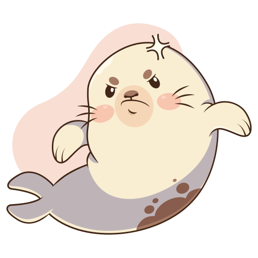

# Shoprab.
A project created by me for my own satisfaction and curiosity. It is an "Interactive, psychological web game with a shopping mechanic for powers".
# How I got The Idea.
- I actually got this idea from the game would you rather while playing in class. But to not copy that wholly i add a twist. I converted the powere in products in a shop which one needs to buy.

  
  
  
  
  
  
  
  
  
  

# How The Website Works.
- User starts at the landing page and clicks Start Now to enter the game.

- In the shop (game.html), they select powers, each costing voids and having a sacrifice.

- The void counter updates in real-time, preventing overspending.

- Clicking Checkout shows selected powers with costs and sacrifices on checkout.html.

- Accept Powers confirms the choices and redirects to a thank you page (thank.html).

  
  
  
  
  
  
  
  
  
  

# Features of Shoprab:-

- Landing page (index.html) – This is kind of a home page and looking at the colors one can easily guess the theme.

- Rules page (rules.html) – Explaination of all the rules about void, sacrifices and power.

- Enter page (play.html) – Animated glowing borders, spider webs in background and also the entering button to the shop

- Shop page (game.html) – Lot of power card with their cost and required sacrifices. As you select a card, the top void displayed of yours gets lesser .

- Checkout page (checkout.html) – Shows selected powers, their costs, and sacrifices . All the voids spent were totalled.

  
  
  
  
  
  
  
  
  
  

# Languages Used

- HTML(basic)

- CSS(stying)

- Javascript(for making page interactive).

  
  
  
  
  
  
  
  
  
  

  

